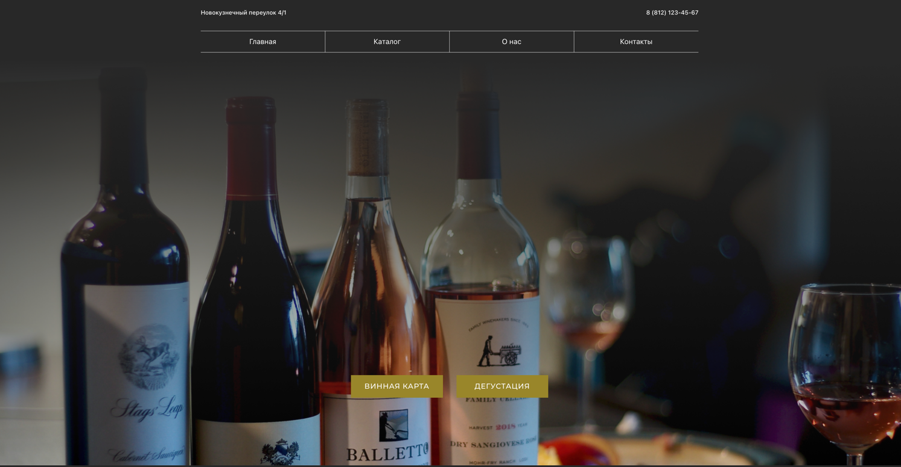
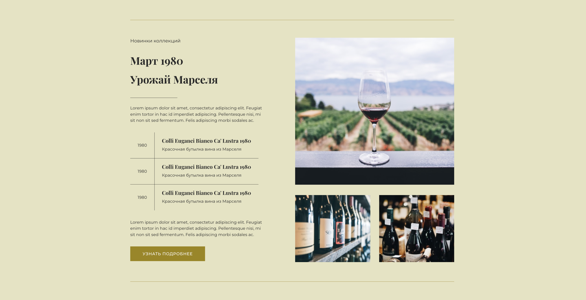
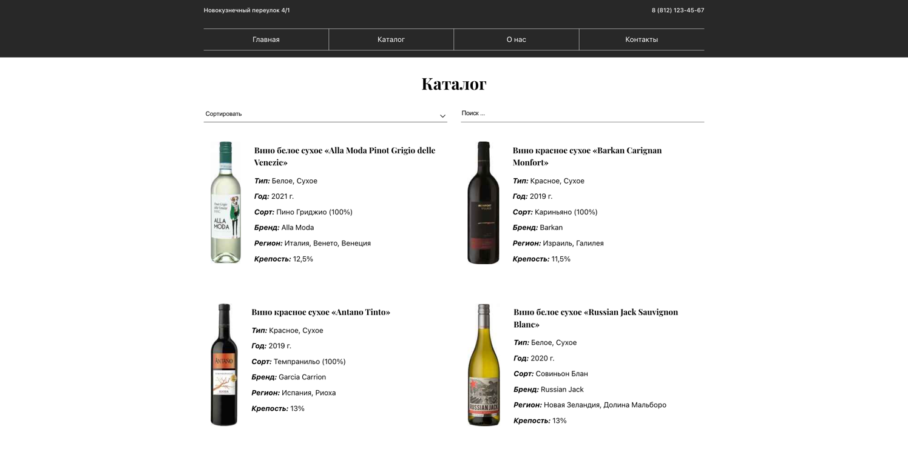

# SPA приложение по поиску вина и записи на винные встречи.
Приложение разработано по готовому макету, реализована сортировка и фильтрация данных на странице каталога.

<a href='https://www.figma.com/file/14uMiycN37B1uIWpkDquPN/%D0%9D%D0%BE%D0%B2%D0%BE%D0%BA%D1%83%D0%B7%D0%BD%D0%B5%D1%87%D0%BD%D1%8B%D0%B9-%D0%BF%D0%B5%D1%80%D0%B5%D1%83%D0%BB%D0%BE%D0%BA-4%2F1-%2B?node-id=2780%3A14&t=qodavqKzM2KoQJB9-0'>
Ссылка на макет (немного переделал футер)
</a>

#### Стек - React, SCSS, Craco, Prettier, Prettier Trivago, React Hook Form, React Input Mask, React Router Dom.

### Команда для запуска проекта локально:

### `npm start`

Проект запускается на 3000 порту [http://localhost:3000](http://localhost:3000)

### Демонстрация интерфейса

